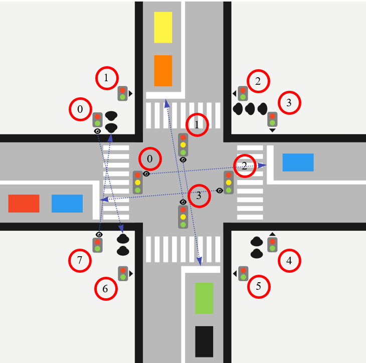

# Описание решения задачи

> Описание логики работы приведено ниже.

Сначала необходимо создать модель описанного в задаче перекрёстка.  
Для этого я использовал шаблон проектирования Абстрактная фабрика:

- абстрактный класс для светофора:

```java
public abstract class TrafficLights {
    public abstract List<TrafficLight> getTrafficLights();
}
```

- фабрика для создания пешеходных и автомобильных светофоров:

```java
public interface CrossroadFactory {
    CarTrafficLights getCarTrafficLights();

    PedestrianTrafficLights getPedestrianTrafficLights();
}
```

Имплементации фабрики находятся в директории _crossroad_factory.impl_.  
На них я останавливаться не буду, с ними и так всё ясно.

Далее я создал необходимые для решения задачи сущности:

- светофора:

```java
public class TrafficLight {
    private int id;
    private TrafficLightColor color;
    private Queue<Message> messages;
    private int count;

    public TrafficLight() {
    }

    public TrafficLight(int id, TrafficLightColor color, Queue<Message> messages, int count) {
        this.id = id;
        this.color = color;
        this.messages = messages;
        this.count = count;
    }

    public int getId() {
        return id;
    }

    public void setId(int id) {
        this.id = id;
    }

    public TrafficLightColor getColor() {
        return color;
    }

    public void setColor(TrafficLightColor color) {
        this.color = color;
    }

    public Queue<Message> getMessages() {
        return messages;
    }

    public void setMessages(Queue<Message> messages) {
        this.messages = messages;
    }

    public int getCount() {
        return count;
    }

    public void setCount(int count) {
        this.count = count;
    }

    @Override
    public boolean equals(Object o) {
        if (this == o) return true;
        if (o == null || getClass() != o.getClass()) return false;
        TrafficLight that = (TrafficLight) o;
        return id == that.id && count == that.count && Objects.equals(color, that.color);
    }

    @Override
    public int hashCode() {
        return Objects.hash(id, color, count);
    }

    @Override
    public String toString() {
        return "TrafficLight{" +
                "id=" + id +
                ", color='" + color + '\'' +
                ", messages=" + messages +
                ", count=" + count +
                '}';
    }

    public void sendMessage(Message message, long timeout) {
        ExecutorService service = Executors.newFixedThreadPool(12);
        Thread thread = new Thread(() -> {
            addMessage(message);
        });
        try {
            thread.sleep(timeout);
        } catch (InterruptedException e) {
            Thread.currentThread().interrupt();
        }
        service.submit(thread);
        thread.start();
    }

    private void addMessage(Message message) {
        Queue<Message> messages = getMessages();
        messages.add(message);
        setMessages(messages);
    }
}
```

- сообщения:

> При этом, в качестве id в сообщение я выбрал значение id адресата сообщения, а не автора, как было записано в задании,
> ибо так сама логика работы становится проще и прозрачнее.

```java
public class Message {
    private int count;
    private int id;
    private TrafficLightColor color;

    public Message() {
    }

    public Message(int count, int id, TrafficLightColor color) {
        this.count = count;
        this.id = id;
        this.color = color;
    }

    public int getCount() {
        return count;
    }

    public void setCount(int count) {
        this.count = count;
    }

    public int getId() {
        return id;
    }

    public void setId(int id) {
        this.id = id;
    }

    public TrafficLightColor getColor() {
        return color;
    }

    public void setColor(TrafficLightColor color) {
        this.color = color;
    }

    @Override
    public boolean equals(Object o) {
        if (this == o) return true;
        if (o == null || getClass() != o.getClass()) return false;
        Message message = (Message) o;
        return count == message.count && id == message.id && Objects.equals(color, message.color);
    }

    @Override
    public int hashCode() {
        return Objects.hash(count, id, color);
    }

    @Override
    public String toString() {
        return "Message{" +
                "count=" + count +
                ", id=" + id +
                ", color='" + color + '\'' +
                '}';
    }
}
```

- enum для переключения цветов светофоров:

```java
public enum TrafficLightColor {
    GREEN, YELLOW, RED
}
```

- сущность для хранения текущего состояния перекрёстка:

```java
public class CrossroadCondition {
    private List<TrafficLight> carTrafficLights;
    private List<TrafficLight> pedestrianTrafficLights;

    public CrossroadCondition() {
    }

    public CrossroadCondition(List<TrafficLight> carTrafficLights, List<TrafficLight> pedestrianTrafficLights) {
        this.carTrafficLights = carTrafficLights;
        this.pedestrianTrafficLights = pedestrianTrafficLights;
    }

    public List<TrafficLight> getCarTrafficLights() {
        return carTrafficLights;
    }

    public void setCarTrafficLights(List<TrafficLight> carTrafficLights) {
        this.carTrafficLights = carTrafficLights;
    }

    public List<TrafficLight> getPedestrianTrafficLights() {
        return pedestrianTrafficLights;
    }

    public void setPedestrianTrafficLights(List<TrafficLight> pedestrianTrafficLights) {
        this.pedestrianTrafficLights = pedestrianTrafficLights;
    }

    @Override
    public boolean equals(Object o) {
        if (this == o) return true;
        if (o == null || getClass() != o.getClass()) return false;
        CrossroadCondition that = (CrossroadCondition) o;
        return Objects.equals(carTrafficLights, that.carTrafficLights) && Objects.equals(pedestrianTrafficLights, that.pedestrianTrafficLights);
    }

    @Override
    public int hashCode() {
        return Objects.hash(carTrafficLights, pedestrianTrafficLights);
    }

    @Override
    public String toString() {
        return "CrossroadCondition{" +
                "\n" +
                "carTrafficLights=" +
                "\n" +
                carTrafficLights +
                ", \n" +
                "pedestrianTrafficLights=" +
                "\n" +
                pedestrianTrafficLights +
                "\n" +
                '}';
    }
}
```

- константу для хранения значения паузы между переключениями:

```java
public class Timeout {
    public static final long TIMEOUT = 1000;
}
```

После этого я перешёл непосредственно к сервисам.  
В первую очередь сделал интерфейс и его реализацию для изменения текущего состояния перекрёстка:

```java
public interface Condition {
    CrossroadCondition getCrossroadCondition();

    void setCrossroadCondition(CrossroadCondition crossroadCondition);
}
```

```java
public class ConditionImpl implements Condition {
    private CrossroadCondition crossroadCondition;

    @Override
    public synchronized CrossroadCondition getCrossroadCondition() {
        return crossroadCondition;
    }

    @Override
    public synchronized void setCrossroadCondition(CrossroadCondition crossroadCondition) {
        this.crossroadCondition = crossroadCondition;
    }
}
```

После этого создал интерфейс сервиса, в котором, собственно, и реализован алгоритм управления:

```java
public interface CrossroadService {
    void makeSwitches();

    void manage();
}
```

```java
public class CrossroadServiceImpl implements CrossroadService {
    private final Condition condition;

    public CrossroadServiceImpl(Condition condition) {
        this.condition = condition;
    }

    /**
     * A method for switching traffic lights.
     */
    @Override
    public void makeSwitches() {
        CrossroadCondition crossroadCondition = condition.getCrossroadCondition();
        List<TrafficLight> carTrafficLights = crossroadCondition.getCarTrafficLights();
        List<TrafficLight> pedestrianTrafficLights = crossroadCondition.getPedestrianTrafficLights();
        for (int i = 0; i < carTrafficLights.size(); i++) {
            int index;
            if (i != 0) {
                index = i - 1;

            } else {
                index = carTrafficLights.size() - 1;
            }
            new Thread(() -> {
                Queue<Message> messages = carTrafficLights.get(index).getMessages();
                while (!messages.isEmpty()) {
                    Message message = messages.poll();
                    TrafficLight trafficLight = carTrafficLights.get(message.getId());
                    trafficLight.setCount(message.getCount());
                    trafficLight.setColor(message.getColor());
                    carTrafficLights.set(message.getId(), trafficLight);
                }
            }).start();
        }
        for (int i = 0; i < pedestrianTrafficLights.size(); i++) {
            int index;
            if (i != 0) {
                index = i - 1;

            } else {
                index = pedestrianTrafficLights.size() - 1;
            }
            new Thread(() -> {
                Queue<Message> messages = pedestrianTrafficLights.get(index).getMessages();
                while (!messages.isEmpty()) {
                    Message message = messages.poll();
                    TrafficLight trafficLight = pedestrianTrafficLights.get(message.getId());
                    trafficLight.setCount(message.getCount());
                    trafficLight.setColor(message.getColor());
                    pedestrianTrafficLights.set(message.getId(), trafficLight);
                }
            }).start();
        }
        CrossroadCondition newCrossroadCondition = new CrossroadCondition(carTrafficLights, pedestrianTrafficLights);
        condition.setCrossroadCondition(newCrossroadCondition);
    }

    /**
     * A method for managing traffic lights.
     */
    @Override
    public void manage() {
        CrossroadCondition crossroadCondition = condition.getCrossroadCondition();
        List<TrafficLight> carTrafficLights = crossroadCondition.getCarTrafficLights();
        List<TrafficLight> pedestrianTrafficLights = crossroadCondition.getPedestrianTrafficLights();
        if (checkTrafficLightsColor(carTrafficLights) && checkTrafficLightsColor(pedestrianTrafficLights)) {
            analyze(carTrafficLights, pedestrianTrafficLights);
        } else {
            try {
                Thread.sleep(Timeout.TIMEOUT);
            } catch (InterruptedException e) {
                Thread.currentThread().interrupt();
            }
            manage();
        }
    }

    /**
     * A method for checking that all traffic lights are {@link TrafficLightColor#RED}
     *
     * @param trafficLights
     * @return boolean
     */
    private static boolean checkTrafficLightsColor(List<TrafficLight> trafficLights) {
        for (TrafficLight trafficLight : trafficLights) {
            if (!trafficLight.getColor().equals(TrafficLightColor.RED)) {
                return false;
            }
        }
        return true;
    }

    /**
     * A method for analyzing the number of people and cars at an intersection and determining traffic light switches.
     *
     * @param carTrafficLights
     * @param pedestrianTrafficLights
     */
    private void analyze(List<TrafficLight> carTrafficLights, List<TrafficLight> pedestrianTrafficLights) {
        int carsCount = carTrafficLights.stream()
                                        .mapToInt(TrafficLight::getCount)
                                        .sum();
        int peopleCount = pedestrianTrafficLights.stream()
                                                 .mapToInt(TrafficLight::getCount)
                                                 .sum();
        if (peopleCount == 0 && carsCount == 0) {
            manage();
        }
        if (peopleCount >= carsCount * 2) {
            setTrafficLightsByPeopleCount(carTrafficLights, pedestrianTrafficLights);
        } else {
            setTrafficLightsByCarsCount(carTrafficLights, pedestrianTrafficLights);
        }
    }

    /**
     * A method that determining traffic light switches by people count.
     *
     * @param carTrafficLights
     * @param pedestrianTrafficLights
     */
    private void setTrafficLightsByPeopleCount(List<TrafficLight> carTrafficLights, List<TrafficLight> pedestrianTrafficLights) {
        List<Integer> peopleByDirection = new ArrayList<>();
        for (int i = 0; i < pedestrianTrafficLights.size(); i = i + 2) {
            if (i != 0) {
                peopleByDirection.add(pedestrianTrafficLights.get(i).getCount() + pedestrianTrafficLights.get(i - 1).getCount());
            } else {
                peopleByDirection.add(pedestrianTrafficLights.get(0).getCount() + pedestrianTrafficLights.get(pedestrianTrafficLights.size() - 1).getCount());
            }
        }
        int maxDirectionIndex = maxDirectionIndex(peopleByDirection);
        int firstPedestrianTrafficLight;
        int secondPedestrianTrafficLight;
        if (maxDirectionIndex != 0) {
            firstPedestrianTrafficLight = maxDirectionIndex * 2 - 1;
            secondPedestrianTrafficLight = maxDirectionIndex * 2;
        } else {
            firstPedestrianTrafficLight = 0;
            secondPedestrianTrafficLight = pedestrianTrafficLights.size() - 1;
        }
        int firstCarTrafficLight;
        int secondCarTrafficLight;
        if (maxDirectionIndex != carTrafficLights.size() - 1) {
            firstCarTrafficLight = maxDirectionIndex + 1;
        } else {
            firstCarTrafficLight = 0;
        }
        if (maxDirectionIndex != 0) {
            secondCarTrafficLight = maxDirectionIndex - 1;
        } else {
            secondCarTrafficLight = carTrafficLights.size() - 1;
        }
        setLights(carTrafficLights, pedestrianTrafficLights, firstCarTrafficLight, secondCarTrafficLight, firstPedestrianTrafficLight, secondPedestrianTrafficLight);
    }

    /**
     * A method for searching the index of the busiest destination.
     *
     * @param direction
     * @return maxDirectionIndex
     */
    private int maxDirectionIndex(List<Integer> direction) {
        int maxDirectionIndex = 0;
        int maxDirection = direction.get(0);
        for (int i = 1; i < direction.size(); i++) {
            if (direction.get(i) > maxDirection) {
                maxDirection = direction.get(i);
                maxDirectionIndex = i;
            }
        }
        return maxDirectionIndex;
    }

    /**
     * A method for switching traffic light colors.
     *
     * @param carTrafficLights
     * @param pedestrianTrafficLights
     * @param firstCarTrafficLight
     * @param secondCarTrafficLight
     * @param firstPedestrianTrafficLight
     * @param secondPedestrianTrafficLight
     */
    private void setLights(List<TrafficLight> carTrafficLights, List<TrafficLight> pedestrianTrafficLights, int firstCarTrafficLight, int secondCarTrafficLight, int firstPedestrianTrafficLight, int secondPedestrianTrafficLight) {
        int secondCarTrafficLightCount = carTrafficLights.get(secondCarTrafficLight).getCount();
        int secondPedestrianTrafficLightCount = pedestrianTrafficLights.get(secondPedestrianTrafficLight).getCount();
        int firstPedestrianTrafficLightCount = pedestrianTrafficLights.get(firstPedestrianTrafficLight).getCount();
        carTrafficLights.get(firstCarTrafficLight).sendMessage(
                new Message(secondCarTrafficLightCount,
                            secondCarTrafficLight,
                            TrafficLightColor.YELLOW),
                Timeout.TIMEOUT);
        makeSwitches();
        if (secondCarTrafficLightCount > 0) {
            secondCarTrafficLightCount = secondCarTrafficLightCount - 1;
        }
        if (secondPedestrianTrafficLightCount > 0) {
            secondPedestrianTrafficLightCount = secondPedestrianTrafficLightCount - 1;
        }
        if (firstPedestrianTrafficLightCount > 0) {
            firstPedestrianTrafficLightCount = firstPedestrianTrafficLightCount - 1;
        }
        carTrafficLights.get(firstCarTrafficLight).sendMessage(
                new Message(secondCarTrafficLightCount,
                            secondCarTrafficLight,
                            TrafficLightColor.GREEN),
                Timeout.TIMEOUT);
        pedestrianTrafficLights.get(firstPedestrianTrafficLight).sendMessage(
                new Message(secondPedestrianTrafficLightCount,
                            secondPedestrianTrafficLight,
                            TrafficLightColor.GREEN),
                Timeout.TIMEOUT * 2);
        pedestrianTrafficLights.get(secondPedestrianTrafficLight).sendMessage(
                new Message(firstPedestrianTrafficLightCount,
                            firstPedestrianTrafficLight,
                            TrafficLightColor.GREEN),
                Timeout.TIMEOUT * 2);
        makeSwitches();
        secondCarTrafficLightCount = carTrafficLights.get(secondCarTrafficLight).getCount();
        secondPedestrianTrafficLightCount = pedestrianTrafficLights.get(secondPedestrianTrafficLight).getCount();
        firstPedestrianTrafficLightCount = pedestrianTrafficLights.get(firstPedestrianTrafficLight).getCount();
        carTrafficLights.get(firstCarTrafficLight).sendMessage(
                new Message(secondCarTrafficLightCount,
                            secondCarTrafficLight,
                            TrafficLightColor.YELLOW),
                Timeout.TIMEOUT);
        pedestrianTrafficLights.get(firstPedestrianTrafficLight).sendMessage(
                new Message(secondPedestrianTrafficLightCount,
                            secondPedestrianTrafficLight,
                            TrafficLightColor.RED),
                Timeout.TIMEOUT * 2);
        pedestrianTrafficLights.get(secondPedestrianTrafficLight).sendMessage(
                new Message(firstPedestrianTrafficLightCount,
                            firstPedestrianTrafficLight,
                            TrafficLightColor.RED),
                Timeout.TIMEOUT * 2);
        makeSwitches();
        carTrafficLights.get(firstCarTrafficLight).sendMessage(
                new Message(secondCarTrafficLightCount,
                            secondCarTrafficLight,
                            TrafficLightColor.RED),
                Timeout.TIMEOUT);
        makeSwitches();
        manage();
    }

    /**
     * A method that determining traffic light switches by cars count.
     *
     * @param carTrafficLights
     * @param pedestrianTrafficLights
     */
    private void setTrafficLightsByCarsCount(List<TrafficLight> carTrafficLights, List<TrafficLight> pedestrianTrafficLights) {
        List<Integer> carsByDirection = carTrafficLights.stream()
                                                        .map(TrafficLight::getCount)
                                                        .toList();
        int maxDirectionIndex = maxDirectionIndex(carsByDirection);
        int firstCarTrafficLight = 0;
        int secondCarTrafficLight = maxDirectionIndex;
        switch (maxDirectionIndex) {
            case 0 -> {
                firstCarTrafficLight = 2;
            }
            case 1 -> {
                firstCarTrafficLight = 3;
            }
            case 2 -> {
                firstCarTrafficLight = 0;
            }
            case 3 -> {
                firstCarTrafficLight = 1;
            }
        }
        int firstPedestrianTrafficLight = 0;
        int secondPedestrianTrafficLight = 0;
        switch (maxDirectionIndex) {
            case 0 -> {
                firstPedestrianTrafficLight = 1;
                secondPedestrianTrafficLight = 2;
            }
            case 1 -> {
                firstPedestrianTrafficLight = 3;
                secondPedestrianTrafficLight = 4;
            }
            case 2 -> {
                firstPedestrianTrafficLight = 5;
                secondPedestrianTrafficLight = 6;
            }
            case 3 -> {
                firstPedestrianTrafficLight = 7;
            }
        }
        setLights(carTrafficLights, pedestrianTrafficLights, firstCarTrafficLight, secondCarTrafficLight, firstPedestrianTrafficLight, secondPedestrianTrafficLight);
    }
}
```

Назначение каждого отдельного метода реализации интерфейса сервиса я оформил в виде javadoc's.  
На них я останавливаться не буду.
Ну а в классе Main сымитирована работа клиента.

```java
public class Main {
    public static void main(String[] args) {
        // Получаем модель перекрёстка
        CrossroadCondition crossroadCondition = getCrossroadCondition();
        Condition condition = new ConditionImpl();
        condition.setCrossroadCondition(crossroadCondition);
        // Инжектим в клиент сервис для управления светофорами
        CrossroadService crossroadService = new CrossroadServiceImpl(condition);
        // Изменяем начальные значения количества людей/машин для каждого из направлений
        int leftUpToLeftDownPeople = 0;
        int leftUpToRightUpPeople = 1;
        int rightUpToLeftUpPeople = 2;
        int rightUpToRightDownPeople = 3;
        int rightDownToRightUpPeople = 4;
        int rightDownToLeftDownPeople = 5;
        int leftDownToRightDownPeople = 6;
        int leftDownToLeftUpPeople = 7;
        int leftToRightCars = 0;
        int UpToDownCars = 1;
        int rightToLeftCars = 2;
        int downToUpCars = 3;
        setPedestrianAndCarsCount(crossroadService,
                                  condition,
                                  leftUpToLeftDownPeople,
                                  leftUpToRightUpPeople,
                                  rightUpToLeftUpPeople,
                                  rightUpToRightDownPeople,
                                  rightDownToRightUpPeople,
                                  rightDownToLeftDownPeople,
                                  leftDownToRightDownPeople,
                                  leftDownToLeftUpPeople,
                                  leftToRightCars,
                                  UpToDownCars,
                                  rightToLeftCars,
                                  downToUpCars);
        // Передаём текущее состояние алгоритму управления светофорами
        crossroadService.manage();
    }

    private static CrossroadCondition getCrossroadCondition() {
        CrossroadFactory crossroad = new CrossroadFactoryImpl();
        CrossroadCondition crossroadCondition = new CrossroadCondition();
        crossroadCondition.setCarTrafficLights(crossroad.getCarTrafficLights().getTrafficLights());
        crossroadCondition.setPedestrianTrafficLights(crossroad.getPedestrianTrafficLights().getTrafficLights());
        return crossroadCondition;
    }

    private static void setPedestrianAndCarsCount(CrossroadService crossroadService,
                                                  Condition condition,
                                                  int leftUpToLeftDownPeople,
                                                  int leftUpToRightUpPeople,
                                                  int rightUpToLeftUpPeople,
                                                  int rightUpToRightDownPeople,
                                                  int rightDownToRightUpPeople,
                                                  int rightDownToLeftDownPeople,
                                                  int leftDownToRightDownPeople,
                                                  int leftDownToLeftUpPeople,
                                                  int leftToRightCars,
                                                  int UpToDownCars,
                                                  int rightToLeftCars,
                                                  int downToUpCars
                                                 ) {
        //
        Message leftUpToLeftDownPeopleMessage = new Message(leftUpToLeftDownPeople, 0, TrafficLightColor.RED);
        Message leftUpToRightUpPeopleMessage = new Message(leftUpToRightUpPeople, 1, TrafficLightColor.RED);
        Message rightUpToLeftUpPeopleMessage = new Message(rightUpToLeftUpPeople, 2, TrafficLightColor.RED);
        Message rightUpToRightDownPeopleMessage = new Message(rightUpToRightDownPeople, 3, TrafficLightColor.RED);
        Message rightDownToRightUpPeopleMessage = new Message(rightDownToRightUpPeople, 4, TrafficLightColor.RED);
        Message rightDownToLeftDownPeopleMessage = new Message(rightDownToLeftDownPeople, 5, TrafficLightColor.RED);
        Message leftDownToRightDownPeopleMessage = new Message(leftDownToRightDownPeople, 6, TrafficLightColor.RED);
        Message leftDownToLeftUpPeopleMessage = new Message(leftDownToLeftUpPeople, 7, TrafficLightColor.RED);
        //
        Message leftToRightCarsMessage = new Message(leftToRightCars, 0, TrafficLightColor.RED);
        Message UpToDownCarsMessage = new Message(UpToDownCars, 1, TrafficLightColor.RED);
        Message rightToLeftCarsMessage = new Message(rightToLeftCars, 2, TrafficLightColor.RED);
        Message downToUpCarsMessage = new Message(downToUpCars, 3, TrafficLightColor.RED);
        //
        List<TrafficLight> pedestrianTrafficLights = condition.getCrossroadCondition().getPedestrianTrafficLights();
        //
        pedestrianTrafficLights.get(0).sendMessage(leftDownToLeftUpPeopleMessage, Timeout.TIMEOUT);
        pedestrianTrafficLights.get(1).sendMessage(rightUpToLeftUpPeopleMessage, Timeout.TIMEOUT);
        pedestrianTrafficLights.get(2).sendMessage(leftUpToRightUpPeopleMessage, Timeout.TIMEOUT);
        pedestrianTrafficLights.get(3).sendMessage(rightDownToRightUpPeopleMessage, Timeout.TIMEOUT);
        pedestrianTrafficLights.get(4).sendMessage(rightUpToRightDownPeopleMessage, Timeout.TIMEOUT);
        pedestrianTrafficLights.get(5).sendMessage(leftDownToRightDownPeopleMessage, Timeout.TIMEOUT);
        pedestrianTrafficLights.get(6).sendMessage(rightDownToLeftDownPeopleMessage, Timeout.TIMEOUT);
        pedestrianTrafficLights.get(7).sendMessage(leftUpToLeftDownPeopleMessage, Timeout.TIMEOUT);
        //
        List<TrafficLight> carTrafficLights = condition.getCrossroadCondition().getCarTrafficLights();
        //
        carTrafficLights.get(0).sendMessage(rightToLeftCarsMessage, Timeout.TIMEOUT);
        carTrafficLights.get(1).sendMessage(downToUpCarsMessage, Timeout.TIMEOUT);
        carTrafficLights.get(2).sendMessage(leftToRightCarsMessage, Timeout.TIMEOUT);
        carTrafficLights.get(3).sendMessage(UpToDownCarsMessage, Timeout.TIMEOUT);
        //
        crossroadService.makeSwitches();
    }
}
```

## Описание логики работы

Логика работы построена довольно просто.
Всем светофорам на картинке ниже присвоен свой уникальный _id_.


> Поскольку светофоры разные и содержатся в различных списках, то и нумерация у них различная (своя для каждой категории
> светофоров).

Анализ задачи показал, что при включении зелёного цвета на одном автомобильном светофоре блокируется движение по трём
пешеходным переходам. К примеру, при зелёном свете автомобильного светофора с _id = 0_ движение пешеходов на участках
_0 - 7_, _7 - 0_, _3 - 4_, _4 -3_, _5 - 6_, _6 - 5_ будет заблокировано (автомобили двигаются в прямом направлении и
направо), однако движение пешеходов на участках _1 - 2_ и _2 - 1_ является безопасным. Что означает, что при включении
автомобильного светофора я могу разгружать одну автомобильную очередь (по одному автомобилю за переключение) и две
пешеходные очереди (в двух встречных направлениях).

Этот анализ и положен в основу логики приложения. Приложение анализирует, в каком направлении одновременное максимальное
количество людей и машин, после чего производит переключение одного автомобильного и двух пешеходных светофоров. По
окончании переключения и уменьшения соответствующих очередей производится переключение всех светофоров в красный цвет и
анализ повторяется.