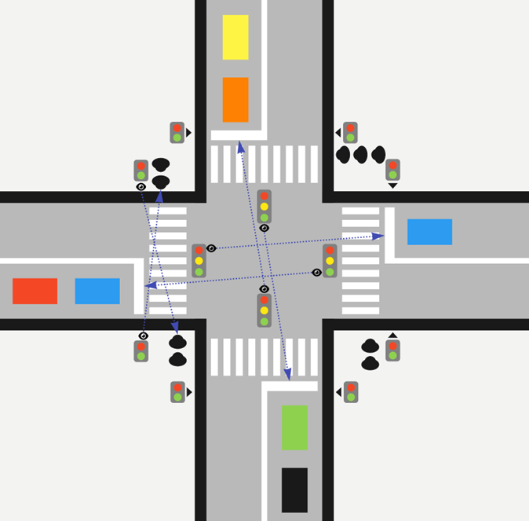

# Тестовое задание

Рассмотрим перекресток на рисунке. На нем находится несколько светофоров, регулирующих движение автомобилей (**_4 шт._**), и несколько - движение пешеходов по переходам (**_8 шт._**):

У пешеходных светофоров **_2_** состояния, у автомобильных - **_3_**. В каждый светофор встроена камера, которая
фиксирует количество автомобилей/пешеходов в той очереди, для которых светофор установлен. Это очередь на
противоположной стороне пешехода/перекрестка (см. рисунок). Автомобили при проезде перекрестка едут либо прямо, либо
направо. Люди и автомобили осуществляют переход или проезд перекрестка по одному, уменьшая размер соответствующей
очереди на **_1_**.

Каждый светофор имеет уникальный **_id_**. Светофоры могут общаться при помощи событий, отсылая события друг другу по 
**_id_**. Пересылаемые события - это некоторые контейнеры с данными (например, там может лежать количество
людей/автомобилей в очереди, **_id_** отправителя, текущее состояние светофора). Светофор может взводить таймер, который
через заданное время отсылают заданное событие на заданный **_id_**. Отправка события - это помещение контейнера в
очередь событий для светофора, у каждого светофора очередь своя собственная. Светофоры обрабатывают события параллельно,
независимо от друг от друга. При этом каждый светофор обрабатывает свои события последовательно, в том порядке, в каком
они помещаются в очередь. Светофор может получить информацию о текущем состоянии любого другого светофора синхронно (не
через событие).

## Задача:

_Придумать и описать адаптивный алгоритм работы светофоров для оптимизации общей пропускной способности
перекрестка в зависимости от ситуации на перекрестке._